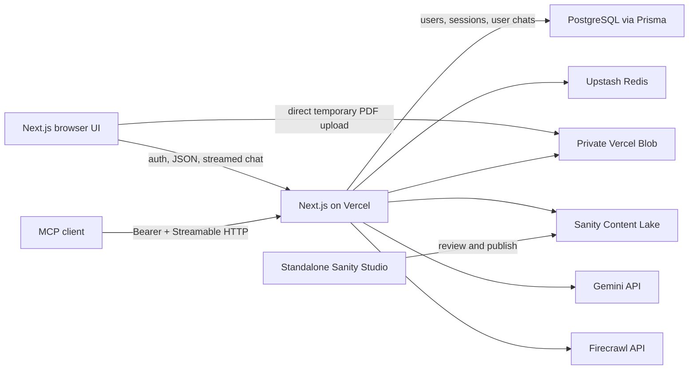

# Milestone 1 — Architecture and Application Foundation

## Outcome

Replace the current workspace/handbook foundation with the shared infrastructure required by every target feature: Sanity clients, configuration validation, common errors, IP extraction, rate limiting, and the top-level application shell.

## System context



Sanity is the durable store for compliance PDF assets, extracted rules, and editorial content. PostgreSQL (managed via Prisma) is the transactional store for user identities, Better-Auth sessions, and user-scoped chat conversations. Vercel Blob is temporary upload ingress.

## Target source structure

```text
src/
  app/
    api/
      auth/[...all]/route.ts
      blob/upload/route.ts
      documents/ingest/route.ts
      documents/route.ts
      documents/[documentId]/route.ts
      chat/route.ts
      conversations/[conversationId]/route.ts
      mcp/route.ts
      health/route.ts
    page.tsx
  components/
    app-shell.tsx
    AuthForm.tsx
    chat/
    documents/
  lib/
    auth.ts
    auth-client.ts
    prisma.ts
    config.ts
    errors.ts
    http.ts
    rate-limit.ts
    sanity/
      clients.ts
      queries.ts
      types.ts
    ai/
      model.ts
      extraction.ts
      research.ts
    mcp/
      tools.ts
prisma/
  schema.prisma
sanity/
  schemaTypes/
```

Names may follow existing casing conventions, but responsibilities and dependency directions are fixed. Route handlers call services in `src/lib`; shared Sanity/MCP logic must not be duplicated inside route files.

## Client boundaries

Create explicit Sanity clients:

- `publishedClient`: read token, `perspective: "published"`, no drafts. Use for chat, UI reads, and MCP.
- `writeClient`: write token, `useCdn: false`. Use for assets, app records, status changes, and Actions API calls.

Neither client may be imported by a Client Component. All tokens remain server-side.

## Shared HTTP contract

Non-streaming failures use:

```ts
type ApiErrorBody = {
  error: {
    code: string
    message: string
    details?: unknown
  }
}
```

Use stable codes such as `INVALID_REQUEST`, `UNSUPPORTED_FILE`, `FILE_TOO_LARGE`, `PAGE_LIMIT_EXCEEDED`, `NOT_FOUND`, `RATE_LIMITED`, `UPSTREAM_FAILURE`, and `INTERNAL_ERROR`. Do not return upstream response bodies or secret-bearing exception messages.

## Rate limiting

Use Upstash rolling-window limiters keyed by the trusted client IP supplied by Vercel:

- Ingestion: 5 accepted upload tokens per rolling hour per IP.
- Chat: 30 submitted user turns per rolling hour per IP.

Return HTTP `429`, `Retry-After`, and standard limit/remaining/reset metadata. Count ingestion once at upload-token issuance, not again when processing the resulting authorized Blob.

## Tasks

- [ ] Add server-only environment validation.
- [ ] Add published and write Sanity clients with pinned API version.
- [ ] Add common API error and response helpers.
- [ ] Add trusted Vercel IP extraction and the two Upstash limiters.
- [ ] Replace the root screen with a minimal shell containing disabled Chat and Documents tabs.
- [ ] Add a server health check that verifies configuration shape without calling paid upstream APIs.
- [ ] Keep feature routes unimplemented until their milestone.

## Manual checkpoint

1. Build and type-check both applications.
2. Open the root app and confirm the shell renders without Prisma or better-auth access.
3. Temporarily omit one required environment variable and confirm startup names the missing variable without printing any secret.
4. Exercise the rate-limit helper with a local script or route and confirm the sixth ingestion or thirty-first chat request receives `429` and retry metadata.
5. Inspect a production build for accidental client imports of write/read tokens.

## Checkpoint record

- Date:
- Commit:
- Reviewer:
- Result: Pending
- Notes:

