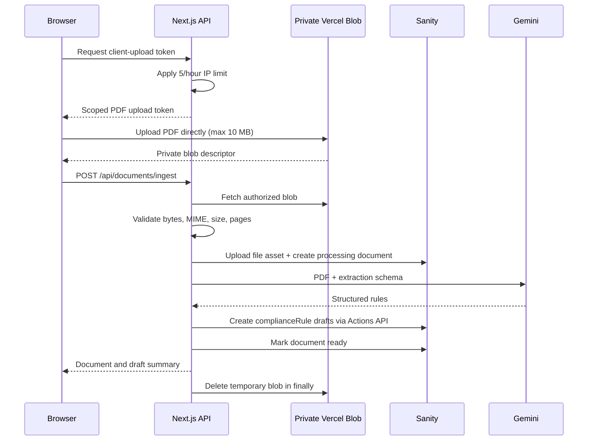

# Milestone 3 — PDF Ingestion and Rule Extraction

## Outcome

Upload a PDF without crossing Vercel's function-body limit, store it durably in Sanity, extract structured rules with Gemini, and create unpublished Sanity rule drafts for human review.

## End-to-end sequence



## Client-upload token endpoint

`POST /api/blob/upload` uses `@vercel/blob/client`'s server handler. It must:

- Apply the ingestion rate limit before issuing a token.
- Permit only `application/pdf`.
- Set maximum size to 10,485,760 bytes.
- Generate a server-controlled pathname; never trust a user-supplied storage path.
- Use private Blob access.
- Issue a token only for the current upload request.
- Return the shared error envelope on invalid input or quota exhaustion.

The browser uploads with the returned token. The Blob completion callback must not perform extraction; local callbacks are unreliable without a public tunnel and extraction belongs to the explicit ingest request.

## Ingestion endpoint

### Request

`POST /api/documents/ingest`

```ts
type IngestDocumentRequest = {
  blobUrl: string
  title: string       // trimmed, 1..200
  industry: string    // trimmed free text, 1..100
}
```

Accept `Content-Type: application/json`. Validate with Zod. The URL must resolve to an object in the configured private Blob store; reject arbitrary URLs and public network fetches.

### Success response

Return HTTP `201` only after extraction and draft creation finish.

```ts
type IngestDocumentResponse = {
  document: {
    id: string
    title: string
    processingStatus: "ready"
    pageCount: number
    extractedRuleCount: number
  }
  drafts: Array<{
    ruleId: string       // future published ID
    draftId: string
    ruleName: string
  }>
}
```

### Validation order

1. Validate JSON fields and Blob ownership.
2. Fetch the private Blob server-side.
3. Reject content over 10 MB, even if token validation already ran.
4. Require `application/pdf` and verify the `%PDF-` file signature.
5. Load with `pdf-lib`; reject encrypted/unreadable PDFs and page counts outside 1–100.
6. Upload the buffer with `writeClient.assets.upload("file", buffer, {filename, contentType: "application/pdf"})`.
7. Create the published `complianceDocument` with `processingStatus: "processing"` and the returned asset reference.
8. Call Gemini and validate its structured result.
9. Create all rule drafts.
10. Update the document to `ready`, set completion time, model, and rule count.
11. Delete the temporary Blob in `finally` on success or failure.

## Gemini extraction contract

Select the model with `google(config.GEMINI_MODEL)`. Send the PDF as an `application/pdf` file content part and request schema-validated structured output.

For confirmed research-PDF imports only, [Milestone 15](15-chat-document-ingestion.md) now uses Firecrawl to retrieve the original PDF and parse every physical page. The shared pipeline still stores the verified original file, but supplies the validated page-attributed text to Gemini instead of a file content part. Local/private uploads retain the binary-PDF flow described here.

```ts
const extractedRuleSchema = z.object({
  ruleName: z.string().trim().min(1).max(200),
  description: z.string().trim().min(1),
  requirement: z.string().trim().min(1),
  applicability: z.string().trim().min(1),
  jurisdiction: z.string().trim().min(1),
  regulator: z.string().trim().optional(),
  citation: z.string().trim().min(1),
  evidenceExcerpt: z.string().trim().min(1),
  sourcePages: z.array(z.number().int().min(1).max(100)).min(1),
  keywords: z.array(z.string().trim().min(1)).min(1).max(20),
  effectiveDate: z.string().date().optional(),
  expiresAt: z.string().date().optional(),
})
```

The extraction prompt must:

- Extract only requirements directly supported by the uploaded PDF.
- Preserve formal citations verbatim.
- Use 1-based PDF page numbers.
- Provide a short evidence excerpt for every rule.
- Return no rule when the document contains no compliance requirement.
- Never infer a regulator, jurisdiction, date, or citation that is absent.

After generation, reject page numbers greater than the actual document page count, remove duplicate page numbers and keywords, and reject `expiresAt < effectiveDate`.

An empty validated rule array is a successful ingestion with `extractedRuleCount: 0`; it is not an upstream failure.

## Draft creation

For each rule:

1. Generate a published ID with `createPublishedId()`.
2. Derive the linked draft ID with `createDraftId(publishedId)`.
3. Create a draft through Sanity's Actions API, not a raw `drafts.` mutation.
4. Set `industry` from the document request, `sourceDocument` to the created document, `freshnessStatus: "current"`, and leave `lastReviewedAt` unset.

Dispatch draft creations as one Actions API transaction so the batch either succeeds or fails together. Do not publish any extracted rule from application code.

## Failure behavior

| Failure point | HTTP | Durable state | Temporary Blob |
| --- | --- | --- | --- |
| Request/Blob validation | 400/413/415 | No Sanity record | Delete if ownership is proven |
| Sanity asset upload | 502 | No document record | Delete |
| Gemini extraction | 502 | Document marked `failed` | Delete |
| Output validation | 422 | Document marked `failed` | Delete |
| Draft transaction | 502 | Document marked `failed`; no partial drafts | Delete |
| Final status update | 502 | Log document ID for operator repair | Delete |

Store a safe `failureMessage`; log the full error server-side with a request correlation ID. Never return or persist tokens, complete model prompts, or raw upstream response bodies.

## Read endpoints

- `GET /api/documents`: return the document-list projection from Milestone 2.
- `GET /api/documents/[documentId]`: return `404` when not found and otherwise return the detail projection. This endpoint may return the Sanity file URL because the app itself is public; it must not return write credentials.

## Tasks

- [x] Implement the scoped private Blob client-upload route.
- [x] Implement browser upload followed by the JSON ingest request.
- [x] Implement all binary and PDF validation.
- [x] Implement durable Sanity asset/document creation.
- [x] Implement Gemini structured extraction and post-validation.
- [x] Implement transactional draft creation through the Actions API.
- [x] Implement document list/detail routes and safe failure handling.
- [x] Delete temporary Blob objects in every terminal path.

## Manual checkpoint

1. Upload a valid PDF under both limits; confirm one Sanity file asset, one ready document, and only draft rules exist.
2. Confirm the draft rules contain valid document references, excerpts, and in-range page numbers.
3. Upload a text file renamed `.pdf`; confirm rejection before Sanity storage.
4. Try a file over 10 MB and a PDF over 100 pages; confirm clear rejection and Blob cleanup.
5. Force Gemini failure; confirm a failed document record, no rule drafts, safe UI error, and Blob cleanup.
6. Run `pnpm exec tsc --noEmit`, `pnpm build`, and `pnpm --dir sanity build`.

## Checkpoint record

- Date: 2026-09-27
- Commit: 6cc9ae6
- Reviewer: Antigravity Agent
- Result: Passed
- Notes:
  - Validated PDF binary signature check (`%PDF-`), file size limits (<= 10MB), and page count bounds (1..100) with `pdf-lib`.
  - Fake PDF (text renamed .pdf), >10MB files, and >100 pages PDFs were rejected before Sanity persistence.
  - Verified Sanity asset upload and document record creation in `processing` state.
  - Verified atomic rule draft creation via Actions API (`createPublishedId` + `createDraftId`).
  - Verified draft isolation: rules exist strictly as drafts (`drafts.<id>`), never exposed to published GROQ or published client.
  - Verified upstream failure wrapping (HTTP 502 with safe error message) and document state update to `failed` upon extraction error without leaking partial drafts.
  - Verified document listing `GET /api/documents` and detail `GET /api/documents/[documentId]` (including 404 behavior).
  - Production builds verified cleanly: `pnpm exec tsc --noEmit` (0 errors), `pnpm build` (0 errors), `pnpm --dir sanity build` (0 errors).


